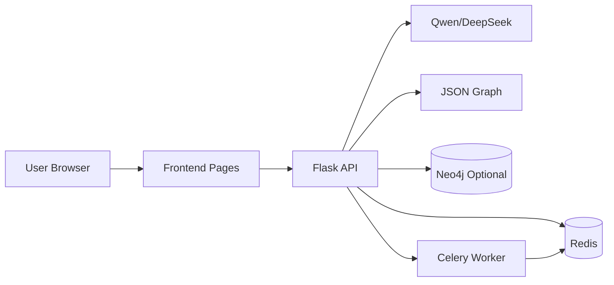

# 坊知工 FZG

面向学习场景的智能学习伴侣，提供问答、知识图谱、诊断、推荐、复习提醒一体化能力。

## 目录

- [2 分钟快速开始](#2-分钟快速开始)
- [常用命令](#常用命令)
- [首次配置详细步骤](#首次配置详细步骤)
- [项目功能](#项目功能)
- [系统架构](#系统架构)
- [页面与接口](#页面与接口)
- [项目结构](#项目结构)
- [常见问题](#常见问题)

---

## 2 分钟快速开始

1. 安装依赖

```powershell
cd backend
pip install -r requirements.txt
```

2. 配置环境变量（复制并修改）

```powershell
copy .env.example .env
```

至少填写 `QWEN_API_KEY`，其余可先保持默认。

3. 一键启动

```powershell
powershell -ExecutionPolicy Bypass -File backend/start-dev-stack.ps1
```

4. 打开页面

- 前端首页: http://127.0.0.1:5501/index.html
- 健康检查: http://127.0.0.1:5000/health

5. 一键停止（用完关闭）

```powershell
powershell -ExecutionPolicy Bypass -File backend/stop-dev-stack.ps1
```

---

## 常用命令

启动完整开发栈：

```powershell
powershell -ExecutionPolicy Bypass -File backend/start-dev-stack.ps1
```

停止完整开发栈：

```powershell
powershell -ExecutionPolicy Bypass -File backend/stop-dev-stack.ps1
```

查看后端健康状态：

```powershell
Invoke-RestMethod -Uri http://127.0.0.1:5000/health | ConvertTo-Json -Depth 5
```

---

## 首次配置详细步骤

### 1. 运行环境

- Windows 10/11
- Python 3.10+
- Conda（当前项目默认路径为 `D:/anaconda`）
- Git

### 2. 安装后端依赖

```powershell
cd backend
pip install -r requirements.txt
```

如果你使用 conda base 环境，也可以执行：

```powershell
D:/anaconda/Scripts/conda.exe run -p D:\anaconda --no-capture-output pip install -r backend/requirements.txt
```

### 3. 配置 backend/.env

参考 `backend/.env.example`，一个常用模板如下：

```env
AI_PROVIDER=qwen
USE_REAL_AI=true

QWEN_API_KEY=your-qwen-api-key
QWEN_API_URL=https://dashscope.aliyuncs.com/compatible-mode/v1/chat/completions
QWEN_MODEL_NAME=qwen-plus

# OCR
OCR_PROVIDER=mock
QWEN_VL_MODEL_NAME=qwen-vl-plus

# Neo4j（可选）
USE_NEO4J=auto
NEO4J_URI=neo4j+s://<your-instance>.databases.neo4j.io
NEO4J_USERNAME=<your-neo4j-username>
NEO4J_PASSWORD=<your-neo4j-password>
NEO4J_DATABASE=<your-neo4j-database>

# Celery + Redis（可选）
CELERY_BROKER_URL=redis://127.0.0.1:6379/0
CELERY_RESULT_BACKEND=redis://127.0.0.1:6379/1
```

安全提醒：

- `.env` 只保留在本地，不要提交到仓库。
- API Key 泄露后请立即轮换。

### 4. 启动方式

推荐一键启动（Redis + Celery + Flask + 前端）：

```powershell
powershell -ExecutionPolicy Bypass -File backend/start-dev-stack.ps1
```

### 5. 启动成功判定

访问 `http://127.0.0.1:5000/health`，建议至少满足：

```json
{
  "status": "ok",
  "ai_enabled": true,
  "ai_key_configured": true,
  "celery_enabled": true
}
```

说明：

- `neo4j_enabled` 为可选项。配置了 Aura/Neo4j 后应为 `true`。
- 未配置 Neo4j 时为 `false`，系统会自动回退到 JSON 存储。

### 6. 停止服务

仓库已提供一键停止脚本：

```powershell
powershell -ExecutionPolicy Bypass -File backend/stop-dev-stack.ps1
```

这个脚本会尝试停止：

- 后端（5000）
- 前端静态服务（5501）
- Redis（6379）
- Celery 相关进程

---

## 项目功能

- 智能问答: 基于大模型的学习问答与引导。
- 知识图谱: 从问答、笔记、图片内容抽取知识点并构建关系。
- 掌握度追踪: 支持节点掌握度更新、薄弱点识别、复习提醒。
- 学习路径规划: 目标知识点的先修路径生成。
- 错题归因诊断: 分析错误类型并给出改进建议。
- 个性化推荐: 结合学习画像和薄弱点生成推荐内容。
- 异步处理: Celery 任务化处理内容录入，提升交互流畅度。

---

## 系统架构



回退机制：

- Neo4j 未配置时，图谱回退到本地 JSON。
- Redis/Celery 不可用时，任务回退为同步处理。

---

## 页面与接口

核心页面：

- `frontend/index.html`: 首页问答与学习入口
- `frontend/dashboard.html`: 学习仪表盘
- `frontend/knowledge-map.html`: 知识图谱可视化

核心接口：

- `POST /api/ask`: 智能问答
- `GET /api/knowledge_graph`: 获取图谱
- `POST /api/knowledge_graph/mastery`: 更新掌握度
- `DELETE /api/knowledge_graph/node`: 删除节点
- `POST /api/content/ingest_async`: 异步内容录入
- `GET /api/tasks/<task_id>`: 查询异步任务状态
- `GET /health`: 运行状态检查

---

## 项目结构

```text
fzg/
├─ backend/
│  ├─ app.py
│  ├─ knowledge_graph.py
│  ├─ cognitive_diagnosis.py
│  ├─ neo4j_store.py
│  ├─ celery_app.py
│  ├─ requirements.txt
│  ├─ .env.example
│  ├─ start-dev-stack.ps1
│  └─ stop-dev-stack.ps1
├─ frontend/
│  ├─ index.html
│  ├─ dashboard.html
│  ├─ knowledge-map.html
│  ├─ css/
│  └─ js/
└─ data/
```

---

## 常见问题

### 1) PowerShell 拒绝执行脚本

```powershell
powershell -ExecutionPolicy Bypass -File backend/start-dev-stack.ps1
```

### 2) 终端中文乱码

```powershell
chcp 65001
```

### 3) AI 看起来未生效

检查 `/health` 中 `ai_key_configured` 是否为 `true`。

### 4) Neo4j 未启用

检查 `.env` 中以下字段是否完整：

- `NEO4J_URI`
- `NEO4J_USERNAME`
- `NEO4J_PASSWORD`
- `NEO4J_DATABASE`

### 5) Celery 未启用

检查 Redis 6379 端口是否监听，并确认 worker 进程是否启动。

---

## 说明

本项目用于学习与实验场景。提交代码前请清理本地密钥、缓存与运行时数据文件。
